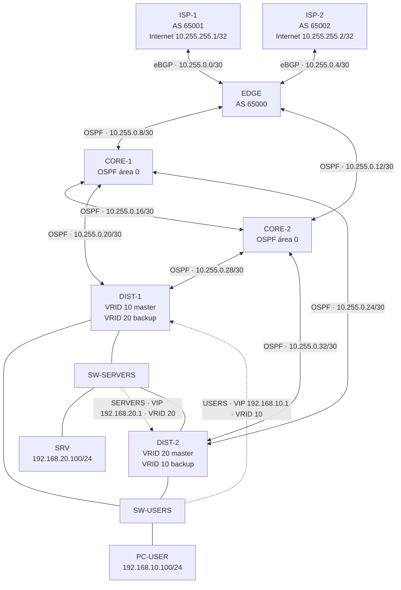

# Esquema de diseño F0

Esquema lógico elaborado para F0; conserva un único EDGE como riesgo residual y no representa una topología desplegada ni sustituye la validación de interfaces en GNS3 (F1). Las nueve redes punto a punto son disjuntas.

Ambos DIST conectan a ambos switches; las líneas punteadas resaltan el master normal de cada gateway virtual. Las IP de los extremos de enlaces, políticas de routing y nombres de interfaz están en [`../memoria.md`](../memoria.md); las rutas LAN de retorno por BGP y los anuncios por OSPF se implementan/verifican en F3. El esquema no incorpora configuración CLI ni define costos OSPF.
